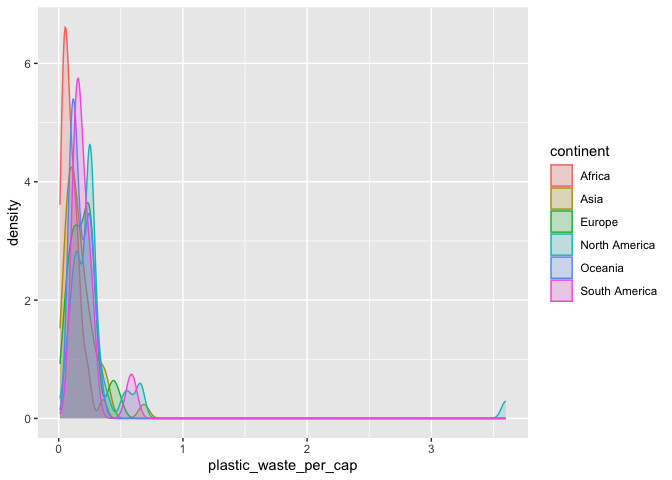
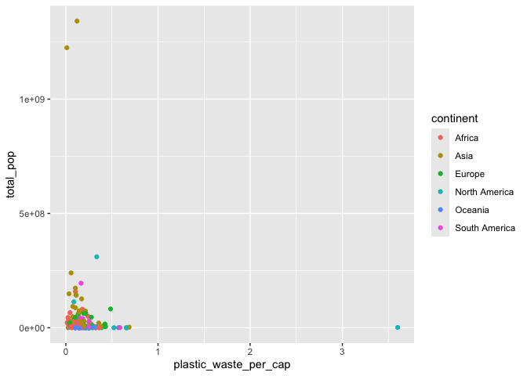
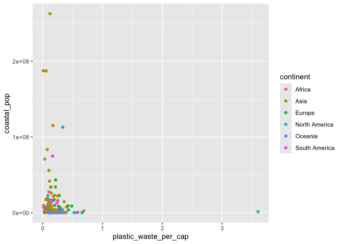
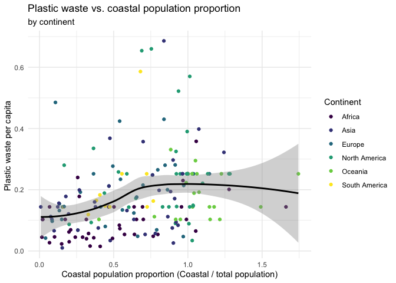

Lab 02 - Plastic waste
================
Noah Booker
01/29/25

## Load packages and data

``` r
library(tidyverse)
```

``` r
plastic_waste <- read.csv("data/plastic-waste.csv")
```

## Exercises

### Exercise 1

Below are histograms plotting the distribution of plastic waste per
capita faceted by continent. The majority of all continents’
distributions of plastic waste per capita fall between 0 and .5 kg/day.
For those continents which have countries with a plastic waste per
capita above .5 kg/day, it seems that North America has the most
followed by South America and Asia tied for second place.

``` r
ggplot(data = plastic_waste, aes(x = plastic_waste_per_cap)) +
    geom_histogram(binwidth = 0.2) + facet_wrap(~continent)
```

    ## Warning: Removed 51 rows containing non-finite outside the scale range
    ## (`stat_bin()`).

<!-- -->

### Exercise 2

Below, we define the color and fill of the curves by mapping aesthetics
of the plot but define the alpha level as a characteristic of the
plotting geom because we want color and fill to vary according to the
data (by continent) but want the alpha level (transparency) to be
applied the same way all the density curves.

``` r
ggplot(
  data = plastic_waste,
  mapping = aes(
    x = plastic_waste_per_cap,
    color = continent,
    fill = continent
  )
) +
  geom_density(alpha = 0.2)
```

    ## Warning: Removed 51 rows containing non-finite outside the scale range
    ## (`stat_density()`).

<!-- -->

### Exercise 3

Unlike the box plots, the violin plots show the shape of the
distribution. This allows one to visualize, for example, whether the
distribution is multimodal (more than one peak). Unlike a violin plot,
box plots explicitly mark the first and third quartiles, the median, and
outliers of each distribution.

``` r
ggplot(
  data = plastic_waste,
  mapping = aes(
    x = continent,
    y = plastic_waste_per_cap
  )
) +
  geom_violin()
```

    ## Warning: Removed 51 rows containing non-finite outside the scale range
    ## (`stat_ydensity()`).

<!-- -->

### Exercise 4

The scatterplot below visualizes the relationship between plastic waste
per capita and mismanaged plastic waste per capita. There seems to be an
overall positive correlation. Also, there seems to be more variance in
mismanaged plastic waste than in overall plastic waste (though they are
visualized in different scales, so this may be misleading).

``` r
ggplot(data = plastic_waste, mapping = aes(x = plastic_waste_per_cap, y = mismanaged_plastic_waste_per_cap)) + geom_point()
```

    ## Warning: Removed 51 rows containing missing values or values outside the scale range
    ## (`geom_point()`).

<!-- -->

There seems to be an overall postive correlation between plastic waste
per capita and mismanage plastic waste per capita. However, some
continents seem to have a larger correlation. For instance, when
comparing Africa to North America, it seems that as plastic waste per
capita increases, mismanaged plastic saste per capita increases more
quickly in Africa than it does in North America.

``` r
ggplot(data = plastic_waste, mapping = aes(x = plastic_waste_per_cap, y = mismanaged_plastic_waste_per_cap, color = continent)) + geom_point()
```

    ## Warning: Removed 51 rows containing missing values or values outside the scale range
    ## (`geom_point()`).

<!-- -->

There seems to be more variance in countries’ coastal populations than
there is countries’ total population, but there doesn’t seem to be any
notable differences in the relationship between the two of these
variables and plastic waste per capita.

``` r
ggplot(data = plastic_waste, mapping = aes(x = plastic_waste_per_cap, y = total_pop, color = continent)) + geom_point()
```

    ## Warning: Removed 61 rows containing missing values or values outside the scale range
    ## (`geom_point()`).

<!-- -->

``` r
ggplot(data = plastic_waste, mapping = aes(x = plastic_waste_per_cap, y = coastal_pop, color = continent)) + geom_point()
```

    ## Warning: Removed 51 rows containing missing values or values outside the scale range
    ## (`geom_point()`).

<!-- -->

### Exercise 5

(I cheated a little bit by finding the code for the graph below in the
github folders for the class slides.) The graph seems to show that there
is a positive assocation between the proportion of a country’s
population that is on the coast and its plastic waste per capita, though
this association levels off at the higher end of coastal population
proportion.

``` r
plastic_waste %>%
  mutate(coastal_pop_prop = coastal_pop / total_pop) %>%
  filter(plastic_waste_per_cap < 3) %>%
  ggplot(aes(
    x = coastal_pop_prop,
    y = plastic_waste_per_cap,
    color = continent
  )) +
  geom_point() +
  geom_smooth(color = "black") +
  scale_color_viridis_d() +
  labs(
    x = "Coastal population proportion (Coastal / total population)",
    y = "Plastic waste per capita ",
    color = "Continent",
    title = "Plastic waste vs. coastal population proportion",
    subtitle = "by continent"
  ) +
  theme_minimal()
```

    ## `geom_smooth()` using method = 'loess' and formula = 'y ~ x'

    ## Warning: Removed 10 rows containing non-finite outside the scale range
    ## (`stat_smooth()`).

    ## Warning: Removed 10 rows containing missing values or values outside the scale range
    ## (`geom_point()`).

<!-- -->
